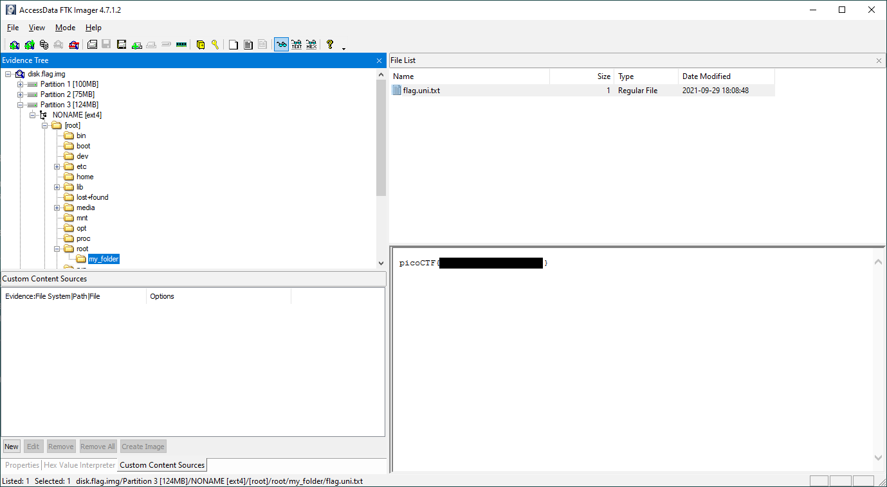

# Sleuthkit Apprentice

- [Challenge information](#challenge-information)
- [Unpacking and Basic file analysis](#unpacking-and-basic-file-analysis)
- [Strings and grep solution](#strings-and-grep-solution)
- [Mount solution](#mount-solution)
- [FTK Imager solution](#ftk-imager-solution)
- [Sleuth Kit solution](#sleuth-kit-solution)
- [References](#references)

## Challenge information

```text
Level: Medium
Tags: picoCTF 2022, Forensics, sleuthkit
Author: LT 'SYREAL' JONES

Description:
Download this disk image and find the flag.

Note: if you are using the webshell, download and extract the disk image into /tmp not your home directory.
Download compressed disk image

Hints:
(None)
```

Challenge link: [https://play.picoctf.org/practice/challenge/300](https://play.picoctf.org/practice/challenge/300)

## Unpacking and basic file analysis

Let's start by unpacking the disk image with `gzip -d`. Add `-k` if you want to keep the original input file.

```bash
┌──(kali㉿kali)-[/mnt/…/picoCTF/picoCTF_2022/Forensics/Sleuthkit_Apprentice]
└─$ gzip -d -k disk.flag.img.gz
gzip: disk.flag.img: Value too large for defined data type
```

Then we can use `file` to identify the type of image

```bash
┌──(kali㉿kali)-[/mnt/…/picoCTF/picoCTF_2022/Forensics/Sleuthkit_Apprentice]
└─$ file disk.flag.img 
disk.flag.img: DOS/MBR boot sector; partition 1 : ID=0x83, active, start-CHS (0x0,32,33), end-CHS (0xc,223,19), startsector 2048, 204800 sectors; partition 2 : ID=0x82, start-CHS (0xc,223,20), end-CHS (0x16,111,25), startsector 206848, 153600 sectors; partition 3 : ID=0x83, start-CHS (0x16,111,26), end-CHS (0x26,62,24), startsector 360448, 253952 sectors
```

Next we check the partition table with the `mmls` tool from [The Sleuth Kit](https://wiki.sleuthkit.org/index.php?title=TSK_Tool_Overview)

```bash
┌──(kali㉿kali)-[/mnt/…/picoCTF/picoCTF_2022/Forensics/Sleuthkit_Apprentice]
└─$ mmls disk.flag.img       
DOS Partition Table
Offset Sector: 0
Units are in 512-byte sectors

      Slot      Start        End          Length       Description
000:  Meta      0000000000   0000000000   0000000001   Primary Table (#0)
001:  -------   0000000000   0000002047   0000002048   Unallocated
002:  000:000   0000002048   0000206847   0000204800   Linux (0x83)
003:  000:001   0000206848   0000360447   0000153600   Linux Swap / Solaris x86 (0x82)
004:  000:002   0000360448   0000614399   0000253952   Linux (0x83)
```

There are two possible partitions where the flag could be:

- The Linux partition which starts on sector `2048`
- The Linux partition which starts on sector `360448`

## Strings and grep solution

The fastest and easiest solution is to run `strings` on the unpacked disk image and `grep` for the flag.  
However, we need to take text encoding into account and do several tries to find the right encoding,  
16-bit big endian in this case.

```bash
┌──(kali㉿kali)-[/mnt/…/picoCTF/picoCTF_2022/Forensics/Sleuthkit_Apprentice]
└─$ strings -n 8 -es disk.flag.img | grep -oE 'picoCTF{.*}'

┌──(kali㉿kali)-[/mnt/…/picoCTF/picoCTF_2022/Forensics/Sleuthkit_Apprentice]
└─$ strings -n 8 -eS disk.flag.img | grep -oE 'picoCTF{.*}'

┌──(kali㉿kali)-[/mnt/…/picoCTF/picoCTF_2022/Forensics/Sleuthkit_Apprentice]
└─$ strings -n 8 -eb disk.flag.img | grep -oE 'picoCTF{.*}'
picoCTF{<REDACTED>}
```

## Mount solution

Another solution is to mount the partitions and search for the flag with `find`.

### Mount the partitions

First, let's create a directory to mount the partitions on

```bash
┌──(kali㉿kali)-[/mnt/…/picoCTF/picoCTF_2022/Forensics/Sleuthkit_Apprentice]
└─$ sudo mkdir /mnt/pico_disk
[sudo] password for kali: 
```

Next, we mount the first partition

```bash
┌──(kali㉿kali)-[/mnt/…/picoCTF/picoCTF_2022/Forensics/Sleuthkit_Apprentice]
└─$ sudo mount -r -o loop,offset=$((2048*512)) disk.flag.img /mnt/pico_disk 
```

### Search for the flag - part 1

Now we check the contents of the partition

```bash
┌──(kali㉿kali)-[/mnt/…/picoCTF/picoCTF_2022/Forensics/Sleuthkit_Apprentice]
└─$ pushd .
/mnt/hgfs/CTFs/picoCTF/picoCTF_2022/Forensics/Sleuthkit_Apprentice /mnt/hgfs/CTFs/picoCTF/picoCTF_2022/Forensics/Sleuthkit_Apprentice

┌──(kali㉿kali)-[/mnt/…/picoCTF/picoCTF_2022/Forensics/Sleuthkit_Apprentice]
└─$ cd /mnt/pico_disk 

┌──(kali㉿kali)-[/mnt/pico_disk]
└─$ ls -la               
total 15757
drwxr-xr-x 3 root root    1024 Sep 29  2021 .
drwxr-xr-x 4 root root    4096 Nov  6 11:33 ..
lrwxrwxrwx 1 root root       1 Sep 29  2021 boot -> .
-rw-r--r-- 1 root root  123781 Aug 27  2021 config-virt
-rw-r--r-- 1 root root     398 Sep 29  2021 extlinux.conf
-rw------- 1 root root 5706879 Sep 29  2021 initramfs-virt
-r--r--r-- 1 root root  116112 Sep 29  2021 ldlinux.c32
-r--r--r-- 1 root root   69632 Sep 29  2021 ldlinux.sys
-rw-r--r-- 1 root root  179720 Sep 29  2021 libcom32.c32
-rw-r--r-- 1 root root   23544 Sep 29  2021 libutil.c32
drwx------ 2 root root   12288 Sep 29  2021 lost+found
-rw-r--r-- 1 root root   11712 Sep 29  2021 mboot.c32
-rw-r--r-- 1 root root   26568 Sep 29  2021 menu.c32
-rw-r--r-- 1 root root 3632749 Aug 27  2021 System.map-virt
-rw-r--r-- 1 root root   27020 Sep 29  2021 vesamenu.c32
-rw-r--r-- 1 root root 6194624 Aug 27  2021 vmlinuz-virt

┌──(kali㉿kali)-[/mnt/pico_disk]
└─$ popd   
/mnt/hgfs/CTFs/picoCTF/picoCTF_2022/Forensics/Sleuthkit_Apprentice

┌──(kali㉿kali)-[/mnt/…/picoCTF/picoCTF_2022/Forensics/Sleuthkit_Apprentice]
└─$ 
```

Nope, this is the wrong partition.

### Search for the flag - part 2

Let's check the next partition instead

```bash
┌──(kali㉿kali)-[/mnt/…/picoCTF/picoCTF_2022/Forensics/Sleuthkit_Apprentice]
└─$ sudo umount /mnt/pico_disk                                              

┌──(kali㉿kali)-[/mnt/…/picoCTF/picoCTF_2022/Forensics/Sleuthkit_Apprentice]
└─$ sudo mount -r -o offset=$((360448*512)) disk.flag.img /mnt/pico_disk 

┌──(kali㉿kali)-[/mnt/…/picoCTF/picoCTF_2022/Forensics/Sleuthkit_Apprentice]
└─$ pushd .
/mnt/hgfs/CTFs/picoCTF/picoCTF_2022/Forensics/Sleuthkit_Apprentice /mnt/hgfs/CTFs/picoCTF/picoCTF_2022/Forensics/Sleuthkit_Apprentice

┌──(kali㉿kali)-[/mnt/…/picoCTF/picoCTF_2022/Forensics/Sleuthkit_Apprentice]
└─$ cd /mnt/pico_disk 
```

Assume the name of the flag file name starts with either `Flag` or `flag` and search for it with `find`.

```bash
┌──(kali㉿kali)-[/mnt/pico_disk]
└─$ sudo find . -name [Ff]lag*                                 
./root/my_folder/flag.uni.txt
```

Success!

### Get the flag

And then we `cat` the contents of the file to get the flag

```bash
┌──(kali㉿kali)-[/mnt/pico_disk]
└─$ sudo cat ./root/my_folder/flag.uni.txt
picoCTF{<REDACTED>}
```

Finally, we unmount the partition

```bash
┌──(kali㉿kali)-[/mnt/pico_disk]
└─$ popd   
/mnt/hgfs/CTFs/picoCTF/picoCTF_2022/Forensics/Sleuthkit_Apprentice
                   
┌──(kali㉿kali)-[/mnt/…/picoCTF/picoCTF_2022/Forensics/Sleuthkit_Apprentice]
└─$ sudo umount /mnt/pico_disk    
```

## FTK Imager solution

Alternatively, we can mount the disk in [FTK Imager](https://www.exterro.com/ftk-imager):

1. In the `File`-menu, select `Add Evidence Item...`
2. Select the `Image File` option in the popup window
3. Browse to the `disk.flag.img` file

In the `Evidence Tree` to the left navigate to `Partition 3` and expand `NONAME` and `[root]`.  
Then expand the `root` directory and select the `my_folder` directory.

Finally, click the `flag.uni.txt` file in the `File List` to view the contents of the flag file.

It should look something like this:



## Sleuth Kit solution

Finally, we can use The Sleuth Kit's commands to find the flag.

We recursively list all filenames in both partitions with `fls` and then `grep` for the flag file

```bash
┌──(kali㉿kali)-[/mnt/…/picoCTF/picoCTF_2022/Forensics/Sleuthkit_Apprentice]
└─$ fls -F -r -o 2048 disk.flag.img | grep [Ff]lag

┌──(kali㉿kali)-[/mnt/…/picoCTF/picoCTF_2022/Forensics/Sleuthkit_Apprentice]
└─$ fls -F -r -o 360448 disk.flag.img | grep [Ff]lag 
r/r * 2082(realloc):    root/my_folder/flag.txt
r/r 2371:       root/my_folder/flag.uni.txt
```

Ah, there is a likely flag file `/root/my_folder/flag.uni.txt` in the second partition.

Then we get the contents of the file with `icat`

```bash
┌──(kali㉿kali)-[/mnt/…/picoCTF/picoCTF_2022/Forensics/Sleuthkit_Apprentice]
└─$ icat -o 360448 disk.flag.img 2371             
picoCTF{<REDACTED>}
```

For additional information, please see the references below.

## References

- [Endianness - Wikipedia](https://en.wikipedia.org/wiki/Endianness)
- [file - Linux manual page](https://man7.org/linux/man-pages/man1/file.1.html)
- [find - Linux manual page](https://man7.org/linux/man-pages/man1/find.1.html)
- [FTK Imager - Homepage](https://www.exterro.com/ftk-imager)
- [grep - Linux manual page](https://man7.org/linux/man-pages/man1/grep.1.html)
- [mount - Linux manual page](https://man7.org/linux/man-pages/man8/mount.8.html)
- [String (computer science) - Wikipedia](https://en.wikipedia.org/wiki/String_(computer_science))
- [strings - Linux manual page](https://man7.org/linux/man-pages/man1/strings.1.html)
- [sudo - Linux manual page](https://man7.org/linux/man-pages/man8/sudo.8.html)
- [The Sleuth Kit - Tool Overview](https://wiki.sleuthkit.org/index.php?title=TSK_Tool_Overview)
- [umount - Linux manual page](https://man7.org/linux/man-pages/man8/umount.8.html)
